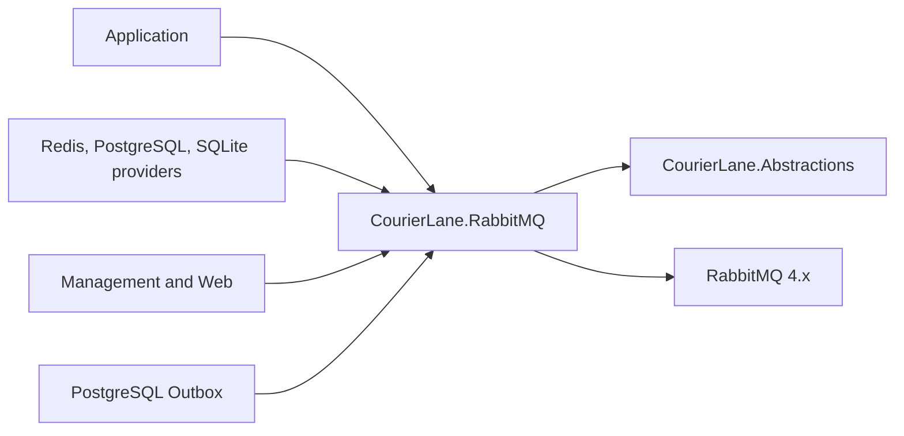
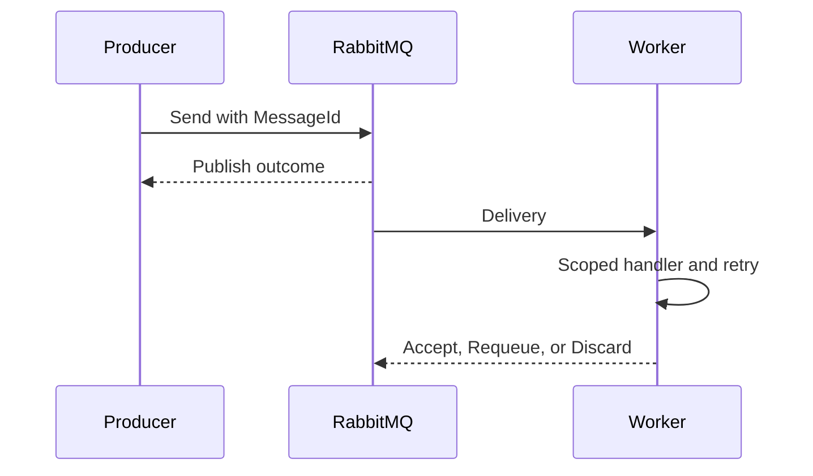
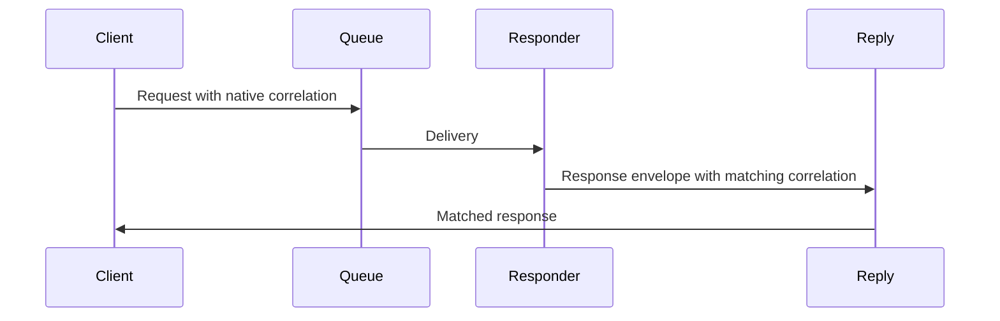
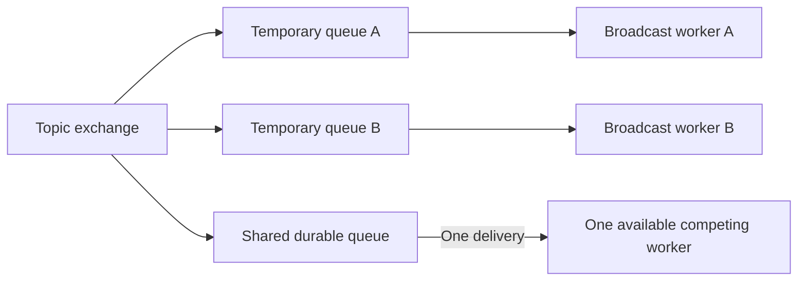
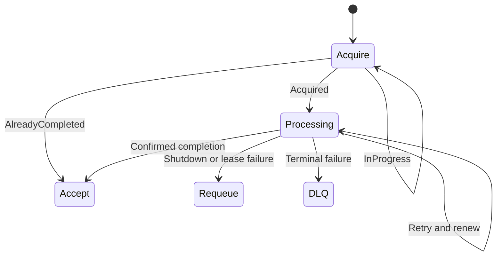
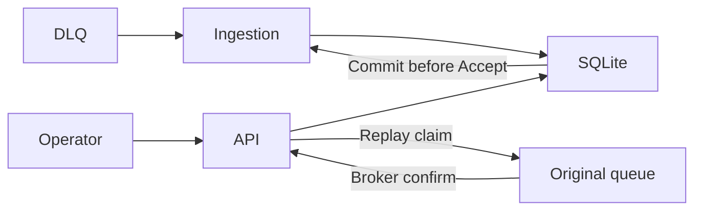
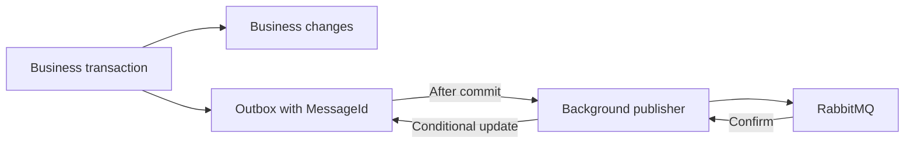

# Diagrams

## Packages

```mermaid
flowchart LR
    App[Application] --> RMQ[CourierLane.RabbitMQ]
    RMQ --> Core[CourierLane.Abstractions]
    RMQ --> Broker[RabbitMQ 4.x]
    Providers[Redis, PostgreSQL, SQLite providers] --> RMQ
    Mgmt[Management and Web] --> RMQ
    Outbox[PostgreSQL Outbox] --> RMQ
```

## Command

```mermaid
sequenceDiagram
    participant Producer
    participant RabbitMQ
    participant Worker
    Producer->>RabbitMQ: Send with MessageId
    RabbitMQ-->>Producer: Publish outcome
    RabbitMQ->>Worker: Delivery
    Worker->>Worker: Scoped handler and retry
    Worker-->>RabbitMQ: Accept, Requeue, or Discard
```

## RPC

```mermaid
sequenceDiagram
    participant Client
    participant Queue
    participant Responder
    participant Reply
    Client->>Queue: Request with native correlation
    Queue->>Responder: Delivery
    Responder->>Reply: Response envelope with matching correlation
    Reply->>Client: Matched response
```

## Broadcast and competing consumers

```mermaid
flowchart LR
    Exchange[Topic exchange] --> P1[Temporary queue A]
    Exchange --> P2[Temporary queue B]
    P1 --> A[Broadcast worker A]
    P2 --> B[Broadcast worker B]
    Exchange --> S[Shared durable queue]
    S -->|One delivery| C[One available competing worker]
```

## Retry, leases, and dead-lettering

```mermaid
stateDiagram-v2
    [*] --> Acquire
    Acquire --> Acquire: InProgress
    Acquire --> Accept: AlreadyCompleted
    Acquire --> Processing: Acquired
    Processing --> Processing: Retry and renew
    Processing --> Accept: Confirmed completion
    Processing --> Requeue: Shutdown or lease failure
    Processing --> DLQ: Terminal failure
```

## DLQ archive and replay

```mermaid
flowchart LR
    DLQ --> Ingestion --> SQLite
    SQLite -->|Commit before Accept| Ingestion
    Operator --> API --> SQLite
    API -->|Replay claim| Original[Original queue]
    Original -->|Broker confirm| API
```

## Transactional outbox

```mermaid
flowchart LR
    Tx[Business transaction] --> Business[Business changes]
    Tx --> Outbox[Outbox with MessageId]
    Outbox -->|After commit| Worker[Background publisher]
    Worker --> Broker[RabbitMQ]
    Broker -->|Confirm| Worker
    Worker -->|Conditional update| Outbox
```
